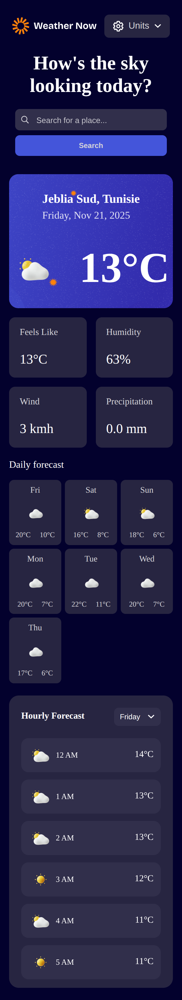

# Weather Application 🌦️

A modern and responsive **React Weather Application** that displays real-time and forecasted weather conditions using the **Open-Meteo API**.  
This project is inspired by a Frontend Mentor design, but fully rebuilt using **React + Vite** with a clean component structure and fast performance.

---

## 🔗 Live Demo

👉 https://691facd74952517f1b1ff2e6--weather-application-from-ahmed.netlify.app/

---

## 🖼️ Screenshots

| Home Screen | Weekly Forecast |
|-------------|-----------------|
|  | .png) |

---

## 📌 Badges


---

## 📘 About the Project

This weather app allows users to search for any city in the world and instantly view:

- Current weather details  
- Hourly forecast  
- 7-day forecast  
- Temperature, humidity, feels-like, wind speed  
- Weather condition icons  
- Unit switching (°C / °F)

The app is fully responsive and optimized for mobile, tablet, and desktop.

Built using **React + Vite**, the goal of this project is to practice API integration, component architecture, state management, and UI responsiveness.

---

## ✨ Features

- 🔍 **City search**
- 🌡️ **Current weather information**
- 📆 **7-day forecast**
- ⏱️ **Hourly forecast view**
- 🔄 **Switch temperature units (°C/°F)**
- 📱 **Fully responsive interface**
- ⚡ **Fast loading with Vite**
- 🎨 Clean, modern UI (Frontend Mentor inspired)
- 🧩 Organised React component structure

---

## 🛠️ Tech Stack

| Technology | Description |
|-----------|-------------|
| **React** | UI and components |
| **Vite** | Build tool & dev server |
| **Open-Meteo API** | Weather data |
| **JavaScript (ES6+)** | Logic |
| **CSS** | Styling |

---

## 📂 Folder Structure

weather-application/
├── public/
├── src/
│ ├── components/
│ ├── pages/
│ ├── hooks/
│ ├── utils/
│ ├── assets/
│ └── App.jsx
├── package.json
└── README.md


---

## 🚀 Getting Started

### 1️⃣ Clone the repository

```bash
git clone https://github.com/boutarfa-ahmed/weather-application.git
cd weather-application

### 2️⃣ Install dependencies

npm install
# or
yarn install

### 3️⃣ Run locally

npm run dev
# or
yarn dev
